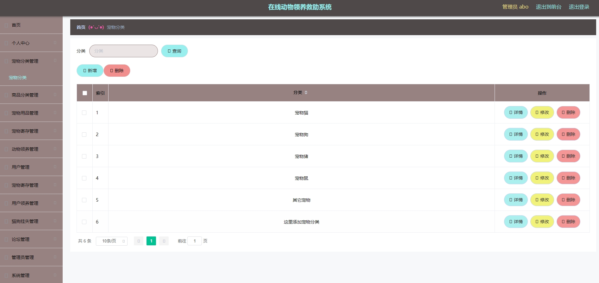
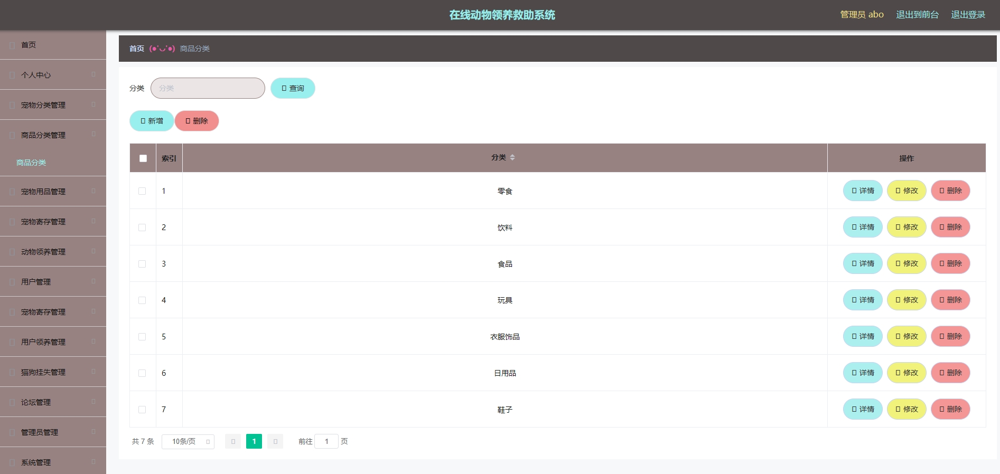
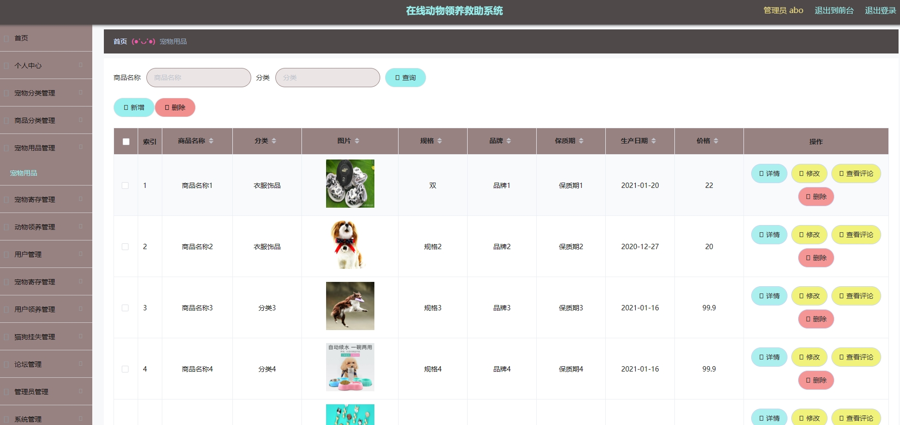
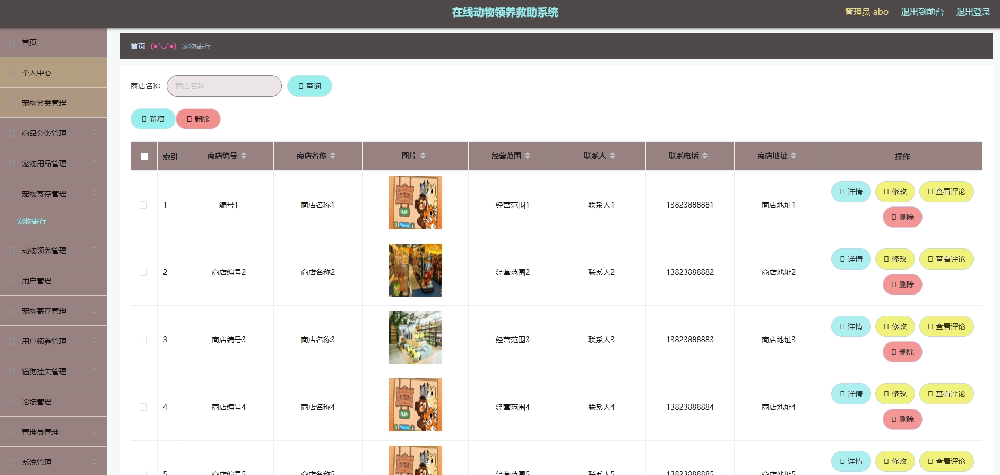
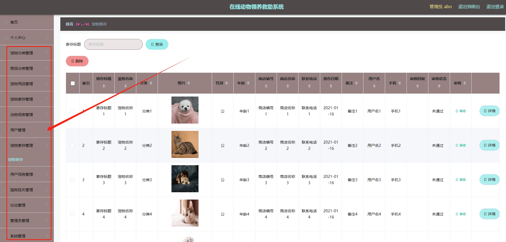
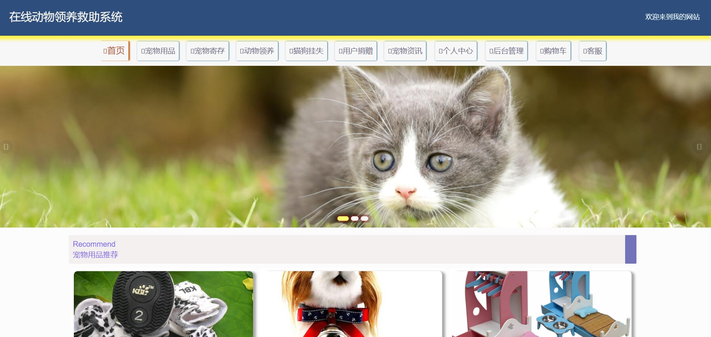
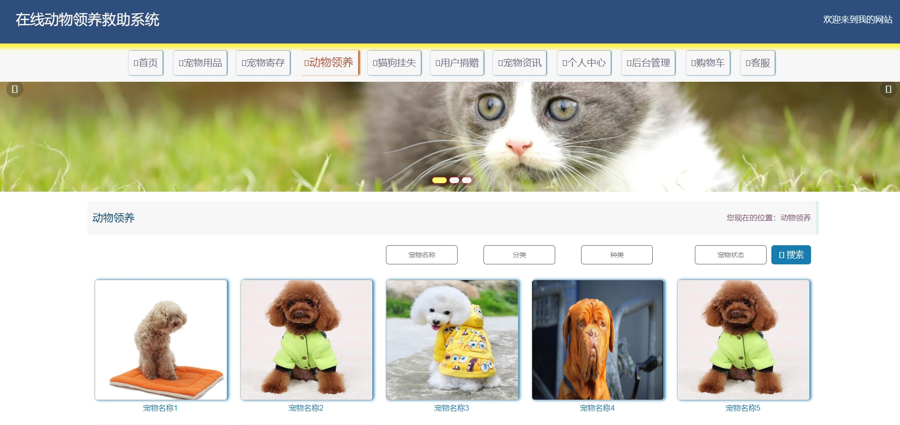
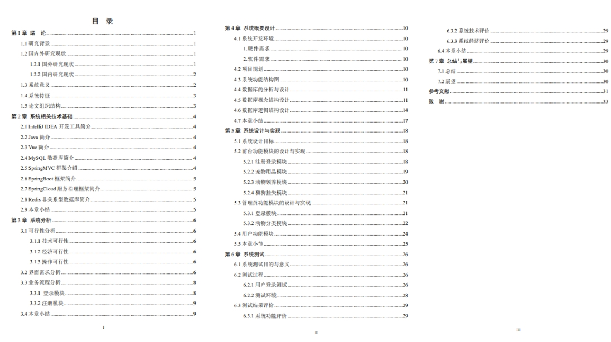

# 1.项目介绍
- 系统角色：管理员、普通用户
- 功能模块：管理员（捐赠管理、领养管理、动物管理、宠物商品管理等）、普通用户（动物领养、用品捐赠、猫狗挂失、宠物用品等）
- 技术栈：SpringBoot、vue、layui（门户web）等
- 测试环境：idea2024、navicat、MySQL5.7、Maven3
#2.项目部署
- 通过Navicat创建数据库，导入sql
- 根据本地数据库环境，修改src/main/resources/application.yml  11-14行（这步很关键）
- 启动项目
- 管理web：http://本机IP:8080/ssmqj7b0/admin/dist/index.html, 账号密码：abo/abo, 不对就查看数据库
- 门户web：http://本机IP:8080/ssmqj7b0/front/index.html  账号密码自行查询数据库
# 3.项目部分截图

# 4.获取方式
[戳我查看](https://gitee.com/aven999/mall)